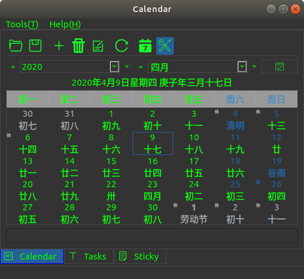
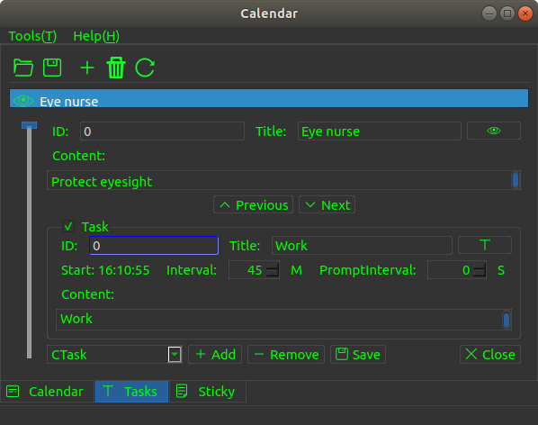

## Calendar

=========================================================

Author: KangLin (kl222@126.com)

[Chinese](README_zh_CN.md)  

[](https://ci.appveyor.com/project/KangLin/Calendar)
[](https://travis-ci.org/KangLin/Calendar)

------------------------------------------------
### Tables of contents

- [Features](#Features)
- [ScreentShot](#ScreentShot)
- [Donation](#Donation)
- [Download setup package](#Download-setup-package)
- [Depend](#Depend)
- [Compile](#Compile)
- [Use](#Use)
- [Contribution](#Contribution)
- [License Agreement](#License-Agreement)

### Features

- [x] calendar
     - [x] Birthady(Year cycle), include lunar and solar
     - [x] Month cycle
     - [x] Week cycle
     - [x] Custom cycle
- [x] Custom task
  - [x] Eye Nurse： Vision protection
- [x] Sticky
- [x] Cross-platform, support multiple operating systems
     - [x] Windows
     - [x] Linux、Unix
     - [x] Android
     - [ ] Mac os
     - [ ] IOS

Mac os and IOS, I don't have the corresponding equipment,
please compile and test the students with the corresponding equipment.

### ScreentShot




### Donation


### [Download setup package](https://github.com/KangLin/Calendar/releases/latest)

- windows
    - [Calendar-Setup-v0.3.5.exe](https://github.com/KangLin/Calendar/releases/download/v0.3.5/Calendar-Setup-v0.3.5.exe)
   Windows installation package, support for Windows xp and above

- android
    + [Calendar_armeabi-v7a_v0.3.5.apk](https://github.com/KangLin/Calendar/releases/download/v0.3.5/Calendar_armeabi-v7a_v0.3.5.apk)

- linux
    - [Calendar_v0.3.5.tar.gz](https://github.com/KangLin/Calendar/releases/download/v0.3.5/Calendar_v0.3.5.tar.gz)  
      The AppImage format executable can be run directly on the Linux system, see: https://appimage.org/  
      Usage:
      
      1. Decompress. Copy Calendar_v0.3.5.tar.gz to install directory, then decompress it:

            ```
            mkdir Calendar
            cd Calendar
            cp $DOWNLOAD/Calendar_v0.3.5.tar.gz .
            tar xvfz Calendar_v0.3.5.tar.gz
            ```

      2. install
      
            ```
            ./install1.sh install_autostart Calendar
            ```

      3. If you want to uninstall
      
            ```
            ./install1.sh remove Calendar
            ```

- ubuntu
    - [Calendar_0.3.5_amd64.deb](https://github.com/KangLin/Calendar/releases/download/v0.3.5/Calendar_0.3.5_amd64.deb)  
   Deb installation package for Ubuntu

### Depend
- [Qt (LGPL v2.1)](http://qt.io/)
- [RabbitCommon](https://github.com/KangLin/RabbitCommon)

    ```
    git clone https://github.com/KangLin/RabbitCommon.git
    ```

- [LunarCalendar](https://github.com/KangLin/LunarCalendar)

### Compile
- Create and enter the build directory

    ```
    git clone --recursive https://github.com/KangLin/Calendar.git
    cd Calendar
    mkdir build
    ```

- Compile

    ```
    cd build
    qmake ../Calendar.pro RabbitCommon_DIR=
    make install
    ```

  + Parameter
    + RabbitCommon_DIR: RabbitCommon source directory
+ Use cmake
  + CMAKE parameter：
    - [MUST] Qt5_DIR: qt install postion(default $QT_ROOT/lib/cmake/Qt5).
                   See：https://doc.qt.io/qt-5/cmake-get-started.html
    - [MUST] RabbitCommon_DIR: RabbitCommon source directory
    - [Optional] CMAKE_INSTALL_PREFIX: install prefix
  + windows or linux

        cd build
        cmake .. -DCMAKE_INSTALL_PREFIX=`pwd`/install \
             -DCMAKE_BUILD_TYPE=Release \
             -DQt5_DIR=${QT_ROOT}/lib/cmake/Qt5 \
             -DRabbitCommon_DIR=
        cmake --build . --config Release --target install
        
  + android
    - The host is linux
      + Compile
      
            cd build
            cmake .. -DCMAKE_BUILD_TYPE=Release \
                -DCMAKE_INSTALL_PREFIX=`pwd`/android-build \
                -DCMAKE_TOOLCHAIN_FILE=${ANDROID_NDK}/build/cmake/android.toolchain.cmake \
                -DANDROID_ABI="armeabi-v7a with NEON" \
                -DANDROID_PLATFORM=android-18 \
                -DQt5_DIR= \
                -DRabbitCommon_DIR= 
            cmake --build . --config Release --target install
            cmake --build . --target APK   

      + Install
        - Install program and libraries
        
                cmake --build . --config Release --target install/strip
                 
        - Generate APK
        
                cmake --build . --config Release --target APK
                 
    - The host is windows
      + Compile
      
            cd build
            cmake .. -G"Unix Makefiles" ^
                -DCMAKE_BUILD_TYPE=Release ^
                -DCMAKE_INSTALL_PREFIX=`pwd`/android-build ^
                -DCMAKE_TOOLCHAIN_FILE=${ANDROID_NDK}/build/cmake/android.toolchain.cmake ^
                -DCMAKE_MAKE_PROGRAM=${ANDROID_NDK}/prebuilt/windows-x86_64/bin/make.exe ^
                -DANDROID_PLATFORM=android-18 ^
                -DANDROID_ABI=arm64-v8a ^
                -DANDROID_ARM_NEON=ON ^
                -DQt5_DIR= ^
                -DRabbitCommon_DIR= 
            cmake --build . --config Release --target install
            cmake --build . --target APK     
      
      + Install
        - Install program and libraries
          
                cmake --build . --config Release --target install/strip
                   
        - Generate APK
          
                cmake --build . --config Release --target APK
                   
    + Parameter Description: https://developer.android.google.cn/ndk/guides/cmake
      + ANDROID_ABI: The following values can be taken:
         Goal ABI. If the target ABI is not specified, CMake uses armeabi-v7a by default.
         Valid ABI are:
        + armeabi：CPU with software floating point arithmetic based on ARMv5TE
        + armeabi-v7a：ARMv7-based device with hardware FPU instructions (VFP v3 D16)
        + armeabi-v7a with NEON：Same as armeabi-v7a, but with NEON floating point instructions enabled. This is equivalent to setting -DANDROID_ABI=armeabi-v7a and -DANDROID_ARM_NEON=ON.
        + arm64-v8a：ARMv8 AArch64 Instruction Set
        + x86：IA-32 Instruction Set
        + x86_64 - x86-64 Instruction Set
      + ANDROID_NDK <path> The path of installed ndk in host
      + ANDROID_PLATFORM: For a full list of platform names and corresponding Android system images, see the [Android NDK Native API] (https://developer.android.google.com/ndk/guides/stable_apis.html)
      + ANDROID_ARM_MODE
      + ANDROID_ARM_NEON
      + ANDROID_STL: Specifies the STL that CMake should use. 
        - c++_shared: The shared library variant of libc++.
        - c++_static: The static library variant of libc++.
        - none: No C++ standard library suport.
        - system: The system STL
    + Install apk to devices

           adb install android-build-debug.apk 

- Note  
    + windows
       If you build app. Qt does not provide openssl dynamic library for copyright reasons, so you must copy the dynamic library of openssl to the installation directory.
        - If it is 32, you can find the dynamic library of openssl (libeay32.dll, ssleay32.dll) in the Qt installer Tools\QtCreator\bin directory.
        - If it is 64-bit, you will need to download the binary installation package for openssl yourself.
  
    + linux

        ```
        sudo apt-get install libssl1.1
        ```

### Use
- pro
    - Library mode:
     Add the following code to the project file:

        ```
        isEmpty(Calendar_DIR): Calendar_DIR=$ENV{Calendar_DIR}
        isEmpty(Calendar_DIR){
            message("1. Please download Calendar source code from https://github.com/KangLin/Calendar")
            message("   ag:")
            message("       git clone https://github.com/KangLin/Calendar.git")
            message("2. Build the project, get library")
            error("2. Then set value Calendar_DIR to library root dirctory")
        }
        INCLUDEPATH *= $${Calendar_DIR}/include $${Calendar_DIR}/include/export
        LIBS *= -L$${Calendar_DIR}/lib -lLunarCalendar -lCalendar
        ```

- cmake
    + Source code
        + Submodule mode

            ```
            add_subdirectory(3th_libs/Calendar/Src)
            ```
      
        + Non-submodule mode

            ```
            set(Calendar_DIR $ENV{Calendar_DIR} CACHE PATH "Set Calendar source code root directory.")
            if(EXISTS ${Calendar_DIR}/Src)
                add_subdirectory(${Calendar_DIR}/Src ${CMAKE_BINARY_DIR}/Calendar)
            else()
                message("1. Please download Calendar source code from https://github.com/KangLin/Calendar")
                message("   ag:")
                message("       git clone https://github.com/KangLin/Calendar.git")
                message("2. Then set cmake value or environment variable Calendar_DIR to download root dirctory.")
                message("    ag:")
                message(FATAL_ERROR "       cmake -DCalendar_DIR= ")
            endif()
            ```
            
    + Library mode:

        + Cmake parameter Calendar_DIR specifies the installation root directory
        
            ```
            FIND_PACKAGE(Calendar)
            ```
        
        + Add libraries and include in CMakeLists.txt

            ```
            SET(APP_LIBS ${PROJECT_NAME} ${QT_LIBRARIES})
            if(Calendar_FOUND)
                target_compile_definitions(${PROJECT_NAME}
                            PRIVATE -DCalendar)
                target_include_directories(${PROJECT_NAME}
                                PRIVATE "${Calendar_INCLUDE_DIRS}/Src"
                                        "${Calendar_INCLUDE_DIRS}/Src/export")
                set(APP_LIBS ${APP_LIBS} ${Calendar_LIBRARIES})
            endif()
            target_link_libraries(${PROJECT_NAME} ${APP_LIBS})
            ```

### Contribution

Question: https://github.com/KangLin/Calendar/issues  
Project location: https://github.com/KangLin/Calendar

### [License Agreement](License.md "License.md")
