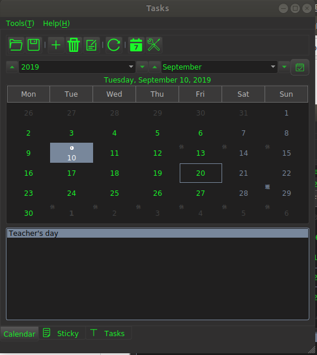
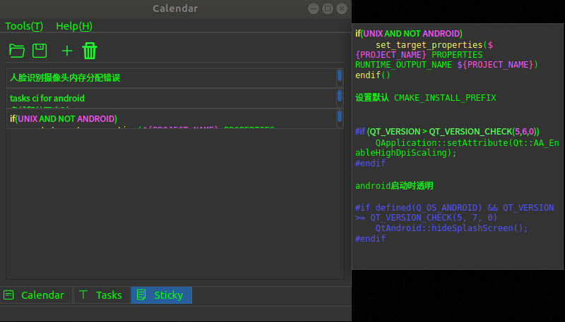
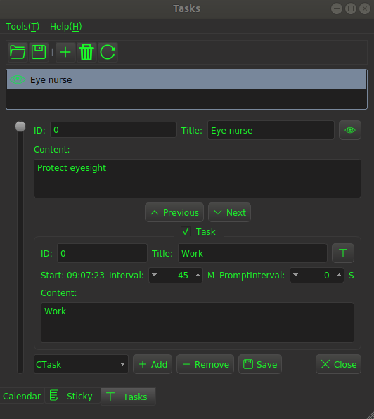

## Tasks

=========================================================

Author: KangLin (kl222@126.com)

[Chinese](README_zh_CN.md)  

[](https://ci.appveyor.com/project/KangLin/tasks)
[](https://travis-ci.org/KangLin/Tasks)

------------------------------------------------
### Tables of contents

- [Features](#Features)
- [ScreentShot](#ScreentShot)
- [Donation](#Donation)
- [Download setup package](#Download-setup-package)
- [Depend](#Depend)
- [Compile](#Compile)
- [Use](#Use)
- [Contribution](#Contribution)
- [License Agreement](#License-Agreement)

### Features

- [x] calendar
     - [x] Birthady(Year cycle), include lunar and solar
     - [x] Month cycle
     - [x] Week cycle
     - [x] Custom cycle
- [x] Custom task
  - [x] Eye Nurse： Vision protection
- [x] Sticky
- [x] Cross-platform, support multiple operating systems
     - [x] Windows
     - [x] Linux、Unix
     - [x] Android
     - [ ] Mac os
     - [ ] IOS

Mac os and IOS, I don't have the corresponding equipment,
please compile and test the students with the corresponding equipment.

### ScreentShot




### Donation


### [Download setup package](https://github.com/KangLin/Tasks/releases/latest)

- linux
    - [Tasks_v0.3.2.tar.gz](https://github.com/KangLin/Tasks/releases/download/v0.3.2/Tasks_v0.3.2.tar.gz)  
      The AppImage format executable can be run directly on the Linux system, see: https://appimage.org/  
      Usage:    
      1. Decompress. Copy Tasks_v0.3.2.tar.gz to install directory, then decompress it:

                mkdir Tasks
                cd Tasks
                cp $DOWNLOAD/Tasks_v0.3.2.tar.gz .
                tar xvfz Tasks_v0.3.2.tar.gz

      2. install

                ./install.sh install

      3. If you want to uninstall

                ./install.sh remove

- ubuntu
    - [tasks_0.3.2_amd64.deb](https://github.com/KangLin/Tasks/releases/download/v0.3.2/tasks_0.3.2_amd64.deb)  
   Deb installation package for Ubuntu

- windows
    - [Tasks-Setup-v0.3.2.exe](https://github.com/KangLin/Tasks/releases/download/v0.3.2/Tasks-Setup-v0.3.2.exe)  
   Windows installation package, support for Windows xp and above

- android
    + [Tasks_v0.3.2.apk](https://github.com/KangLin/Tasks/releases/download/v0.3.2/Tasks_v0.3.2.apk)
    

### Depend
- [Qt (LGPL v2.1)](http://qt.io/)
- [RabbitCommon](https://github.com/KangLin/RabbitCommon)
  
        git clone https://github.com/KangLin/RabbitCommon.git

- [LunarCalendar](https://github.com/KangLin/LunarCalendar)

### Compile
- Create and enter the build directory

        git clone --recursive https://github.com/KangLin/Tasks.git
        cd Tasks
        mkdir build

- Compile

        cd build
        qmake ../Tasks.pro RabbitCommon_DIR=
        make install

+ Use cmake
  + windows or linux

        cd build
        cmake .. -DCMAKE_INSTALL_PREFIX=`pwd`/install \
             -DCMAKE_BUILD_TYPE=Release \
             -DQt5_DIR=${QT_ROOT}/lib/cmake/Qt5 \
             -DRabbitCommon_DIR=
        cmake --build . --config Release --target install
    
  + android
    + The host is linux

            cd build
            cmake .. -DCMAKE_BUILD_TYPE=Release \
                 -DCMAKE_INSTALL_PREFIX=`pwd`/android-build \
                 -DCMAKE_TOOLCHAIN_FILE=${ANDROID_NDK}/build/cmake/android.toolchain.cmake \
                 -DANDROID_ABI="armeabi-v7a with NEON" \
                 -DANDROID_PLATFORM=android-18 \
                 -DQt5_DIR= \
                 -DRabbitCommon_DIR= 
            cmake --build . --config Release --target install
            cmake --build . --target APK   

    + The host is windows

            cd build
            cmake .. -G"Unix Makefiles" \
               -DCMAKE_BUILD_TYPE=Release \
               -DCMAKE_INSTALL_PREFIX=`pwd`/android-build \
               -DCMAKE_TOOLCHAIN_FILE=${ANDROID_NDK}/build/cmake/android.toolchain.cmake \
               -DCMAKE_MAKE_PROGRAM=${ANDROID_NDK}/prebuilt/windows-x86_64/bin/make.exe \
               -DANDROID_PLATFORM=android-18 \
               -DANDROID_ABI=arm64-v8a \
               -DANDROID_ARM_NEON=ON \
               -DQt5_DIR= \
               -DRabbitCommon_DIR= 
            cmake --build . --config Release --target install
            cmake --build . --target APK     
      
    + Parameter Description: https://developer.android.google.cn/ndk/guides/cmake
      + ANDROID_ABI: The following values can be taken:
         Goal ABI. If the target ABI is not specified, CMake uses armeabi-v7a by default.
         Valid ABI are:
        + armeabi：CPU with software floating point arithmetic based on ARMv5TE
        + armeabi-v7a：ARMv7-based device with hardware FPU instructions (VFP v3 D16)
        + armeabi-v7a with NEON：Same as armeabi-v7a, but with NEON floating point instructions enabled. This is equivalent to setting -DANDROID_ABI=armeabi-v7a and -DANDROID_ARM_NEON=ON.
        + arm64-v8a：ARMv8 AArch64 Instruction Set
        + x86：IA-32 Instruction Set
        + x86_64 - x86-64 Instruction Set
      + ANDROID_NDK <path> The path of installed ndk in host
      + ANDROID_PLATFORM: For a full list of platform names and corresponding Android system images, see the [Android NDK Native API] (https://developer.android.google.com/ndk/guides/stable_apis.html)
      + ANDROID_ARM_MODE
      + ANDROID_ARM_NEON
      + ANDROID_STL: Specifies the STL that CMake should use. 
        - c++_shared: The shared library variant of libc++.
        - c++_static: The static library variant of libc++.
        - none: No C++ standard library suport.
        - system: The system STL
    + Install apk to devices

           adb install android-build-debug.apk 

- Note  
    + windows
       If you build app. Qt does not provide openssl dynamic library for copyright reasons, so you must copy the dynamic library of openssl to the installation directory.
        - If it is 32, you can find the dynamic library of openssl (libeay32.dll, ssleay32.dll) in the Qt installer Tools\QtCreator\bin directory.
        - If it is 64-bit, you will need to download the binary installation package for openssl yourself.
  
    + linux
 
     ```
     sudo apt-get install libssl1.1
     ```

### Use
- pro
    - Library mode:
     Add the following code to the project file:
   
            isEmpty(Tasks_DIR): Tasks_DIR=$ENV{Tasks_DIR}
            isEmpty(Tasks_DIR){
                message("1. Please download Tasks source code from https://github.com/KangLin/Tasks")
                message("   ag:")
                message("       git clone https://github.com/KangLin/Tasks.git")
                message("2. Build the project, get library")
                error("2. Then set value Tasks_DIR to library root dirctory")
            }
            INCLUDEPATH *= $${Tasks_DIR}/include $${Tasks_DIR}/include/export
            LIBS *= -L$${Tasks_DIR}/lib -lLunarCalendar -lTasks

- cmake
    + Source code
        + Submodule mode
  
              add_subdirectory(3th_libs/Tasks/Src)
      
        + Non-submodule mode
  
                set(Tasks_DIR $ENV{Tasks_DIR} CACHE PATH "Set Tasks source code root directory.")
                if(EXISTS ${Tasks_DIR}/Src)
                    add_subdirectory(${Tasks_DIR}/Src ${CMAKE_BINARY_DIR}/Tasks)
                else()
                    message("1. Please download Tasks source code from https://github.com/KangLin/Tasks")
                    message("   ag:")
                    message("       git clone https://github.com/KangLin/Tasks.git")
                    message("2. Then set cmake value or environment variable Tasks_DIR to download root dirctory.")
                    message("    ag:")
                    message(FATAL_ERROR "       cmake -DTasks_DIR= ")
                endif()

    + Library mode:

        + Cmake parameter Tasks_DIR specifies the installation root directory
        
            FIND_PACKAGE(Tasks)
        
        + Add libraries and include in CMakeLists.txt

                SET(APP_LIBS ${PROJECT_NAME} ${QT_LIBRARIES})
                if(Tasks_FOUND)
                    target_compile_definitions(${PROJECT_NAME}
                                PRIVATE -DTasks)
                    target_include_directories(${PROJECT_NAME}
                                PRIVATE "${Tasks_INCLUDE_DIRS}/Src"
                                        "${Tasks_INCLUDE_DIRS}/Src/export")
                    set(APP_LIBS ${APP_LIBS} ${Tasks_LIBRARIES})
                endif()
                target_link_libraries(${PROJECT_NAME} ${APP_LIBS})

### Contribution

Question: https://github.com/KangLin/Tasks/issues  
Project location: https://github.com/KangLin/Tasks

### [License Agreement](License.md "License.md")
