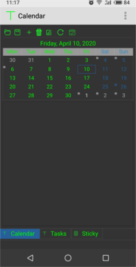
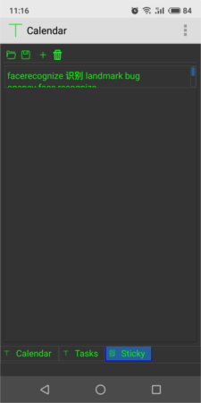
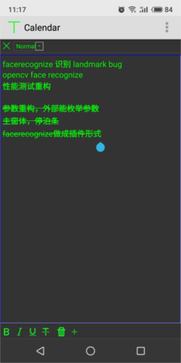
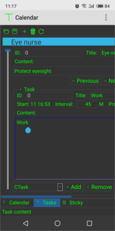

## [Calendar](https://github.com/KangLin/Calendar)  

Author: Kang Lin <kl222@126.com>

-----------------------------------------------
[:cn: 中文](README_zh_CN.md)

[](https://github.com/KangLin/Calendar/actions/workflows/build.yml)
[](https://github.com/KangLin/Calendar/actions/workflows/build.yml)
[](https://ci.appveyor.com/project/KangLin/Calendar)

[](https://github.com/KangLin/Calendar/issues)

[](https://star-history.com/#KangLin/Calendar&Date)
[](https://gitee.com/kl222/Calendar/stargazers)

[](https://github.com/KangLin/Calendar/releases/latest)
[](https://sourceforge.net/projects/rabbitcalendar/files/latest/download)

[](https://github.com/KangLin/Calendar/releases)
[](https://sourceforge.net/projects/rabbitcalendar/files/latest/download)

------------------------------------------------

### Tables of contents

- [Features](#Features)
- [ScreentShot](#ScreentShot)
- [Donation](#Donation)
- [Download](#Download)
- [Depend](#Depend)
- [Compile](#Compile)
- [Use](#Use)
- [Contribution](#Contribution)
- [License Agreement](#License-Agreement)

### Project location:
- Project repository:
  + Main repository: https://github.com/KangLin/Calendar
  + Mirror repository:
    - https://gitlab.com/kl222/Calendar
    - https://gitee.com/kl222/Calendar
    - https://sourceforge.net/projects/rabbitcalendar/
    - https://invent.kde.org/kanglin/Calendar
- [Project home](https://kanglin.github.io/Calendar/)

### Features

- [x] calendar
     - [x] Birthady(Year cycle), include lunar and solar
     - [x] Month cycle
     - [x] Week cycle
     - [x] Custom cycle
- [x] Custom task
  - [x] Eye Nurse： Vision protection
- [x] Sticky
- [x] Cross-platform, support multiple operating systems
     - [x] Windows
     - [x] Linux、Unix
     - [x] Android
     - [x] Mac os
     - [ ] IOS

     Mac os and IOS, I don't have the corresponding equipment,
     please compile and test the students with the corresponding equipment.

   See: [Qt5](https://doc.qt.io/qt-5/supported-platforms.html), [Qt6](https://doc.qt.io/qt-6/supported-platforms.html)

### ScreentShot
- Unix screent shot
  - 
  - 
  - 
- Android screent shot
  - 
  - 
  - 
  - 

### Donation

[](https://gitee.com/kl222/RabbitCommon/raw/master/Src/Resource/image/Contribute_en.png "donation")

### Download

- [](https://github.com/KangLin/Calendar/releases/latest)
- [](https://sourceforge.net/projects/rabbitcalendar/files/latest/download)

### Depend
- [Qt (LGPL v2.1)](http://qt.io/)
  - Qt (official release): https://download.qt.io/official_releases/qt/
    - Set environment variable or cmake parameters:
      - QT_ROOT
      - Qt6: Qt6_ROOT or Qt6_DIR .
        See: https://doc.qt.io/qt-6/cmake-get-started.html
      - Qt5: Qt5_ROOT or Qt5_DIR .
        See: https://doc.qt.io/qt-5/cmake-get-started.html
      - Environment variable

            export QT_ROOT=Qt install root
            # Needed by complied AppImage
            export QMAKE=$QT_ROOT/bin/qmake

            # When Qt6
            export Qt6_ROOT=$QT_ROOT
            # When Qt5
            export Qt5_ROOT=$QT_ROOT

            # Or

            # When Qt6
            export Qt6_DIR=$QT_ROOT/lib/cmake/Qt6
            # When Qt5
            export Qt5_DIR=$QT_ROOT/lib/cmake/Qt5

      - CMAKE parameters

            # Qt6
            cmake -DQT_ROOT=[Qt install root] -DQt6_DIR=[Qt install root]/lib/cmake/Qt6 ......
            # Qt5 
            cmake -DQT_ROOT=[Qt install root] -DQt5_DIR=[Qt install root]/lib/cmake/Qt5 ......
            # Needed by complied AppImage
            export QMAKE=$QT_ROOT/bin/qmake

  - System built-in:  
    - Qt5:
    
          ~$ sudo apt install qttools5-dev qttools5-dev-tools qtbase5-dev qtbase5-dev-tools qtmultimedia5-dev qtlocation5-dev libqt5svg5-dev

    - Qt6: See: [Script/build_depend.sh](../../Script/build_depend.sh)
    
          ~$ sudo apt install qmake6 qt6-tools-dev qt6-tools-dev-tools qt6-base-dev qt6-base-dev-tools qt6-qpa-plugins libqt6svg6-dev qt6-l10n-tools qt6-translations-l10n qt6-scxml-dev qt6-multimedia-dev

    - When multiple distributions of Qt are installed on the system.
      For example: Install Qt5 and Qt6 at the same time.
      The system uses the qtchooser tool to select the current Qt version.
  
          l@l:/home/RabbitRemoteControl$ qtchooser 
          Usage:
            qtchooser { -l | -list-versions | -print-env }
            qtchooser -install [-f] [-local] <name> <path-to-qmake>
            qtchooser -run-tool=<tool name> [-qt=<Qt version>] [program arguments]
            <executable name> [-qt=<Qt version>] [program arguments]

          Environment variables accepted:
           QTCHOOSER_RUNTOOL  name of the tool to be run (same as the -run-tool argument)
           QT_SELECT          version of Qt to be run (same as the -qt argument)
  
      - List which version of Qt is currently installed on your system

            l@l:/home/RabbitRemoteControl$ qtchooser -l
            4
            5
            default
            qt4-x86_64-linux-gnu
            qt4
            qt5-x86_64-linux-gnu
            qt5
            qt6

            # View the Qt version of your current environment
            l@l:/home/RabbitRemoteControl$ qtchooser --print-env
            QT_SELECT="default"
            QTTOOLDIR="[Paths]"
            QTLIBDIR="Prefix=/usr"
    
      - Set the Qt version of your current environment

            export QT_SELECT=qt6  # Set the Qt6 version of your current environment

            # View the Qt version of your current environment
            l@l:/home/RabbitRemoteControl$ qtchooser --print-env
            QT_SELECT="qt6"
            QTTOOLDIR="/usr/lib/qt6/bin"
            QTLIBDIR="/usr/lib/aarch64-linux-gnu"
  
- [RabbitCommon](https://github.com/KangLin/RabbitCommon)

    ```
    git clone https://github.com/KangLin/RabbitCommon.git
    ```

- [LunarCalendar](https://github.com/KangLin/LunarCalendar)

### Compile
- Create and enter the build directory

    ```
    git clone --recursive https://github.com/KangLin/Calendar.git
    cd Calendar
    mkdir build
    ```

- Compile
  + CMAKE parameter：
    + Qt
      + QT_ROOT: Qt install root
      + Qt6: See: https://doc.qt.io/qt-6/cmake-get-started.html
        + Qt6_ROOT: Is same QT_ROOT
        + Qt6_DIR: $QT_ROOT/lib/cmake/Qt6
      + Qt5: See: https://doc.qt.io/qt-5/cmake-get-started.html
        + Qt5_ROOT: Is same QT_ROOT
        + Qt5_DIR: $QT_ROOT/lib/cmake/Qt5
    - [MUST] RabbitCommon_ROOT: RabbitCommon source directory
    - [Optional] CMAKE_INSTALL_PREFIX: install prefix
  + windows or linux

        cd build
        cmake .. -DCMAKE_INSTALL_PREFIX=`pwd`/install \
             -DCMAKE_BUILD_TYPE=Release \
             -DQt6_DIR=${QT_ROOT}/lib/cmake/Qt6 \
             -DRabbitCommon_ROOT=
        cmake --build . --config Release --target install
        
  + android: version greater than 6
    - The host is linux
      + Compile
      
            cd build
            cmake .. -DCMAKE_BUILD_TYPE=Release \
                -DCMAKE_INSTALL_PREFIX=`pwd`/android-build \
                -DCMAKE_TOOLCHAIN_FILE=${ANDROID_NDK}/build/cmake/android.toolchain.cmake \
                -DANDROID_ABI="armeabi-v7a with NEON" \
                -DANDROID_PLATFORM=android-18 \
                -DQT_ROOT=... -DQt6_DIR=... \
                -DRabbitCommon_ROOT= 
            cmake --build . --config Release --target install
     
    - The host is windows
      + Compile
      
            cd build
            cmake .. -G"Unix Makefiles" ^
                -DCMAKE_BUILD_TYPE=Release ^
                -DCMAKE_INSTALL_PREFIX=`pwd`/android-build ^
                -DCMAKE_TOOLCHAIN_FILE=${ANDROID_NDK}/build/cmake/android.toolchain.cmake ^
                -DCMAKE_MAKE_PROGRAM=${ANDROID_NDK}/prebuilt/windows-x86_64/bin/make.exe ^
                -DANDROID_PLATFORM=android-18 ^
                -DANDROID_ABI=arm64-v8a ^
                -DANDROID_ARM_NEON=ON ^
                -DQT_ROOT=... -DQt6_DIR=... ^
                -DRabbitCommon_ROOT= 
            cmake --build . --config Release --target install
       
    + Parameter Description: https://developer.android.google.cn/ndk/guides/cmake
      + ANDROID_ABI: The following values can be taken:
         Goal ABI. If the target ABI is not specified, CMake uses armeabi-v7a by default.
         Valid ABI are:
        + armeabi：CPU with software floating point arithmetic based on ARMv5TE
        + armeabi-v7a：ARMv7-based device with hardware FPU instructions (VFP v3 D16)
        + armeabi-v7a with NEON：Same as armeabi-v7a, but with NEON floating point instructions enabled. This is equivalent to setting -DANDROID_ABI=armeabi-v7a and -DANDROID_ARM_NEON=ON.
        + arm64-v8a：ARMv8 AArch64 Instruction Set
        + x86：IA-32 Instruction Set
        + x86_64 - x86-64 Instruction Set
      + ANDROID_NDK <path> The path of installed ndk in host
      + ANDROID_PLATFORM: For a full list of platform names and corresponding Android system images, see the [Android NDK Native API] (https://developer.android.google.com/ndk/guides/stable_apis.html)
      + ANDROID_ARM_MODE
      + ANDROID_ARM_NEON
      + ANDROID_STL: Specifies the STL that CMake should use. 
        - c++_shared: The shared library variant of libc++.
        - c++_static: The static library variant of libc++.
        - none: No C++ standard library support.
        - system: The system STL
    + Install apk to devices

           adb install android-build-debug.apk 

- Note  
    + windows
       If you build app. Qt does not provide openssl dynamic library for copyright reasons, so you must copy the dynamic library of openssl to the installation directory.
        - If it is 32, you can find the dynamic library of openssl (libeay32.dll, ssleay32.dll) in the Qt installer Tools\QtCreator\bin directory.
        - If it is 64-bit, you will need to download the binary installation package for openssl yourself.
  
    + linux

        ```
        sudo apt-get install libssl1.1
        ```

### Use
- pro
    - Library mode:
     Add the following code to the project file:

        ```
        isEmpty(Calendar_DIR): Calendar_DIR=$ENV{Calendar_DIR}
        isEmpty(Calendar_DIR){
            message("1. Please download Calendar source code from https://github.com/KangLin/Calendar")
            message("   ag:")
            message("       git clone https://github.com/KangLin/Calendar.git")
            message("2. Build the project, get library")
            error("2. Then set value Calendar_DIR to library root directory")
        }
        INCLUDEPATH *= $${Calendar_DIR}/include $${Calendar_DIR}/include/export
        LIBS *= -L$${Calendar_DIR}/lib -lLunarCalendar -lCalendar
        ```

- cmake
    + Source code
        + Submodule mode

            ```
            add_subdirectory(3th_libs/Calendar/Src)
            ```
      
        + Non-submodule mode

            ```
            # Need include ${RabbitCommon_ROOT}/cmake/Translations.cmake
            if( "${RabbitCommon_ROOT}" STREQUAL "" )
                set(RabbitCommon_ROOT $ENV{RabbitCommon_ROOT})
                if( "${RabbitCommon_ROOT}" STREQUAL "" )
                    set(RabbitCommon_ROOT ${CMAKE_SOURCE_DIR}/../RabbitCommon)
                endif()
             endif()

             if(DEFINED RabbitCommon_ROOT AND EXISTS ${RabbitCommon_ROOT}/Src)
                 add_subdirectory(${RabbitCommon_ROOT}/Src ${CMAKE_BINARY_DIR}/RabbitCommon)
                 include(${RabbitCommon_ROOT}/cmake/Translations.cmake)
             else()
                 message("1. Please download RabbitCommon source code from https://github.com/KangLin/RabbitCommon")
                 message("   ag:")
                 message("       git clone https://github.com/KangLin/RabbitCommon.git")
                 message("2. Then set cmake value or environment variable RabbitCommon_ROOT to download root directory.")
                 message("   ag:")
                 message(FATAL_ERROR "       cmake -DRabbitCommon_ROOT= ")
            endif()

            set(Calendar_DIR $ENV{Calendar_DIR} CACHE PATH "Set Calendar source code root directory.")
            if(EXISTS ${Calendar_DIR}/Src)
                add_subdirectory(${Calendar_DIR}/Src ${CMAKE_BINARY_DIR}/Calendar)
            else()
                message("1. Please download Calendar source code from https://github.com/KangLin/Calendar")
                message("   ag:")
                message("       git clone https://github.com/KangLin/Calendar.git")
                message("2. Then set cmake value or environment variable Calendar_DIR to download root directory.")
                message("    ag:")
                message(FATAL_ERROR "       cmake -DCalendar_DIR= ")
            endif()
            ```
            
    + Library mode:

        + Cmake parameter Calendar_DIR specifies the installation root directory
        
            ```
            FIND_PACKAGE(Calendar)
            ```
        
        + Add libraries and include in CMakeLists.txt

            ```
            SET(APP_LIBS ${PROJECT_NAME} ${QT_LIBRARIES})
            if(Calendar_FOUND)
                target_compile_definitions(${PROJECT_NAME}
                            PRIVATE -DCalendar)
                target_include_directories(${PROJECT_NAME}
                                PRIVATE "${Calendar_INCLUDE_DIRS}/Src"
                                        "${Calendar_INCLUDE_DIRS}/Src/export")
                set(APP_LIBS ${APP_LIBS} ${Calendar_LIBRARIES})
            endif()
            target_link_libraries(${PROJECT_NAME} ${APP_LIBS})
            ```

### Contribution

- [Question](https://github.com/KangLin/Calendar/issues)
- [Contributors](https://github.com/KangLin/Calendar/graphs/contributors)

### [License Agreement](License.md "License.md")
