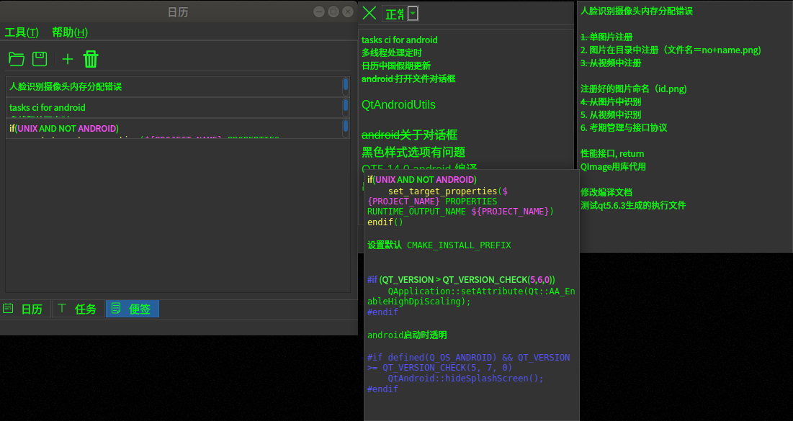

## 任务

================================================

作者：康林（kl222@126.com)

[英语](README.md)

[](https://ci.appveyor.com/project/KangLin/tasks/branch/master)
[](https://travis-ci.org/KangLin/Tasks)
------------------------------------------------

* [功能](#功能)
* [屏幕截图](#屏幕截图)
* [捐赠](#捐赠)
* [下载安装包](#下载安装包)
* [依赖](#依赖)
* [编译](#编译)
* [使用](#使用)
* [贡献](#贡献)
* [许可协议](#许可协议)

### 功能

- [x] 日历
    - [x] 生日提醒（年周期提醒）,包括农历
    - [x] 月周期提醒
    - [x] 周周期提醒
    - [x] 自定义周期
- [x] 自定义任务
  - [x] 眼睛护士: 保护视力
- [x] 便签
- 跨平台，支持多操作系统
  + [x] Windows
  + [x] Linux、Unix
  + [x] Android
  + [ ] Mac os
  + [ ] IOS

Mac os 和 IOS ，本人没有相应设备，请有相应设备的同学自己编译，测试。

### 屏幕截图





### 捐赠
本软件如果对你有用，或者你喜欢它，请你捐赠，支持作者。谢谢！
  


### [下载安装包](https://github.com/KangLin/Tasks/releases/latest)

- linux
    - [Tasks_v0.3.2.tar.gz](https://github.com/KangLin/Tasks/releases/download/v0.3.2/Tasks_v0.3.2.tar.gz)  
      AppImage格式的执行程序，可直接运行在linux系统，详见：https://appimage.org/  
      使用:    
      1. 解压。复制Tasks_v0.3.2.tar.gz到安装目录，然后解压：

                mkdir Tasks
                cd Tasks
                cp $DOWNLOAD/Tasks_v0.3.2.tar.gz .
                tar xvfz Tasks_v0.3.2.tar.gz

      2. 安装
        
                ./install.sh install
        
      3. 如果需要，卸载
        
                ./install.sh remove

- ubuntu
    - [tasks_0.3.2_amd64.deb](https://github.com/KangLin/Tasks/releases/download/v0.3.2/tasks_0.3.2_amd64.deb)  
  deb 安装包,可用于　Ubuntu
  
- windows
    - [Tasks-Setup-v0.3.2.exe](https://github.com/KangLin/Tasks/releases/download/v0.3.2/Tasks-Setup-v0.3.2.exe)  
  Windows安装包，支持 Windows xp 以上系统 

- android
    + [Tasks_v0.3.2.apk](https://github.com/KangLin/Tasks/releases/download/v0.3.2/Tasks_v0.3.2.apk)

### 依赖
- [Qt (LGPL v2.1)](http://qt.io/)
- [RabbitCommon](https://github.com/KangLin/RabbitCommon)
  
        git clone https://github.com/KangLin/RabbitCommon.git

- [LunarCalendar](https://github.com/KangLin/LunarCalendar)

### 编译
- 建立并进入build目录

        git clone --recursive https://github.com/KangLin/Tasks.git
        cd Tasks
        mkdir build

- 编译
        cd build
        qmake ../Tasks.pro RabbitCommon_DIR=
        make install

- 用 cmake
  + windows 或 linux
  
          cd build
          cmake .. -DCMAKE_INSTALL_PREFIX=`pwd`/install \
               -DCMAKE_BUILD_TYPE=Release \
               -DQt5_DIR=${QT_ROOT}/lib/cmake/Qt5 \
               -DRabbitCommon_DIR=
          cmake --build . --config Release --target install
      
  + android
    - 主机是linux

          cd build
          cmake .. -DCMAKE_BUILD_TYPE=Release \
               -DCMAKE_INSTALL_PREFIX=`pwd`/android-build \
               -DCMAKE_TOOLCHAIN_FILE=${ANDROID_NDK}/build/cmake/android.toolchain.cmake \
               -DANDROID_ABI="armeabi-v7a with NEON" \
               -DANDROID_PLATFORM=android-18 \
               -DQt5_DIR= \
               -DRabbitCommon_DIR= 
          cmake --build . --config Release --target install
          cmake --build . --target APK         

    - 主机是windows

          cd build
          cmake .. -G"Unix Makefiles" \
             -DCMAKE_BUILD_TYPE=Release \
             -DCMAKE_INSTALL_PREFIX=`pwd`/android-build \
             -DCMAKE_TOOLCHAIN_FILE=${ANDROID_NDK}/build/cmake/android.toolchain.cmake \
             -DCMAKE_MAKE_PROGRAM=${ANDROID_NDK}/prebuilt/windows-x86_64/bin/make.exe \
             -DANDROID_PLATFORM=android-18 \
             -DANDROID_ABI=arm64-v8a \
             -DANDROID_ARM_NEON=ON \
             -DQt5_DIR= \
             -DRabbitCommon_DIR= 
          cmake --build . --config Release --target install
          cmake --build . --target APK

    - 参数说明：https://developer.android.google.cn/ndk/guides/cmake
      + ANDROID_ABI: 可取下列值：
        目标 ABI。如果未指定目标 ABI，则 CMake 默认使用 armeabi-v7a。  
        有效的目标名称为：
        - armeabi：带软件浮点运算并基于 ARMv5TE 的 CPU。
        - armeabi-v7a：带硬件 FPU 指令 (VFPv3_D16) 并基于 ARMv7 的设备。
        - armeabi-v7a with NEON：与 armeabi-v7a 相同，但启用 NEON 浮点指令。这相当于设置 -DANDROID_ABI=armeabi-v7a 和 -DANDROID_ARM_NEON=ON。
        - arm64-v8a：ARMv8 AArch64 指令集。
        - x86：IA-32 指令集。
        - x86_64 - 用于 x86-64 架构的指令集。
      + ANDROID_NDK <path> 主机上安装的 NDK 根目录的绝对路径
      + ANDROID_PLATFORM: 如需平台名称和对应 Android 系统映像的完整列表，请参阅 [Android NDK 原生 API](https://developer.android.google.cn/ndk/guides/stable_apis.html)
      + ANDROID_ARM_MODE
      + ANDROID_ARM_NEON
      + ANDROID_STL: 指定 CMake 应使用的 STL
        - c++_shared: 使用 libc++ 动态库
        - c++_static: 使用 libc++ 静态库
        - none: 没有 C++ 库支持
        - system: 用系统的 STL

    - 安装 apk 到设备

           adb install android-build-debug.apk 

- 安装注意  
Qt因为版权原因，没有提供openssl动态库，所以必须自己复制openssl的动态库到安装目录下。
    + windows
        - 如果是32的，可以在Qt安装程序Tools\QtCreator\bin目录下，找到openssl的动态库（libeay32.dll、ssleay32.dll）
        - 如果是64位，则需要自己下载openssl的二进制安装包。
    + linux

        ```
        sudo apt-get install libssl1.1
        ```

### 使用
- 直接用源码
  + 是QT工程
    - 库方式:
    在项目文件中加入下列语句：

            isEmpty(Tasks_DIR): Tasks_DIR=$ENV{Tasks_DIR}
            isEmpty(Tasks_DIR){
                message("1. Please download Tasks source code from https://github.com/KangLin/Tasks")
                message("   ag:")
                message("       git clone https://github.com/KangLin/Tasks.git")
                message("2. Build the project, get library")
                error("2. Then set value Tasks_DIR to library root dirctory")
            }
            INCLUDEPATH *= $${Tasks_DIR}/include $${Tasks_DIR}/include/export
            LIBS *= -L$${Tasks_DIR}/lib -lLunarCalendar -lTasks

  + cmake工程
    - 原码：
        + 子模块方式
  
              add_subdirectory(3th_libs/Tasks/Src)
      
        + 非子模块方式
    
                set(Tasks_DIR $ENV{Tasks_DIR} CACHE PATH "Set Tasks source code root directory.")
                if(EXISTS ${Tasks_DIR}/Src)
                    add_subdirectory(${Tasks_DIR}/Src ${CMAKE_BINARY_DIR}/Tasks)
                else()
                    message("1. Please download Tasks source code from https://github.com/KangLin/Tasks")
                    message("   ag:")
                    message("       git clone https://github.com/KangLin/Tasks.git")
                    message("2. Then set cmake value or environment variable Tasks_DIR to download root dirctory.")
                    message("    ag:")
                    message(FATAL_ERROR "       cmake -DTasks_DIR= ")
                endif()
                
    - 库方式:
    
        + Cmake 参数指定 Tasks_DIR 到库安装目录
        
            FIND_PACKAGE(Tasks)
        
        + 在 CMakeLists.txt 中增加头文件和库文件
        
                SET(APP_LIBS ${PROJECT_NAME} ${QT_LIBRARIES})
                if(Tasks_FOUND)
                    target_compile_definitions(${PROJECT_NAME}
                                PRIVATE -DTasks)
                    target_include_directories(${PROJECT_NAME}
                                PRIVATE "${Tasks_INCLUDE_DIRS}/Src"
                                        "${Tasks_INCLUDE_DIRS}/Src/export")
                    set(APP_LIBS ${APP_LIBS} ${Tasks_LIBRARIES})
                endif()
                target_link_libraries(${PROJECT_NAME} ${APP_LIBS})
        
- 加载翻译资源
  + 用库中提供的函数

        CTasksTools::Instance()->InitResource();

  + 自定义

        QString szPre;    
        #if defined(Q_OS_ANDROID) || _DEBUG
            szPre = ":/Translations";
        #else
            szPre = qApp->applicationDirPath() + QDir::separator() + ".." + QDir::separator() + "translations";
        #endif
        m_Translator.load(szPre + "/Tasks_" + QLocale::system().name() + ".qm");
        qApp->installTranslator(&m_Translator);

### 贡献

问题：https://github.com/KangLin/Tasks/issues  
项目位置：https://github.com/KangLin/Tasks

### [许可协议](License.md "License.md")
